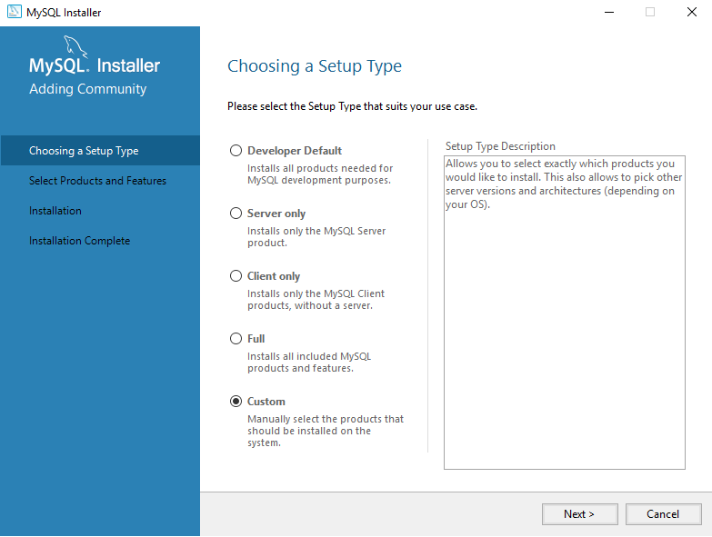
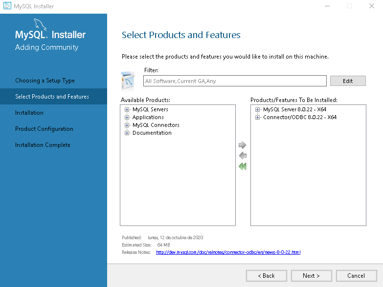

<!-- markdownlint-disable headings -->
<!-- markdownlint-disable no-inline-html -->

# IkData Windows 10 Installer <!-- omit in toc -->

<div class="toc" markdown="1">

## Tabla de Contenido<!-- omit in toc -->

- [Requirements](#requirements)
  - [MySQL](#mysql)
- [Install](#install)
- [Uninstall](#uninstall)

</div>

## Requirements

Ik-Data needs to have a database connection, the supported options are: MySQL, PostgresSQL, SQL Server and Oracle.

By default the database connections is with MySQL, if you need to change it:

1. Go to the Ik-Data installation path
2. Enter to the folder `WindowsServer`
    >Note: For Linux, the folder is `ikdataRunner`

3. Open the file `application.properties`
4. Look for the section `Supported SQL Databases`
5. Uncomment the line with the database connection you need.
    >Warning: This changes will be done with Ik-Data server stopped.

6. Run the Ik-Data server.

<details open>
<summary>Basic MySQL Installation</summary>
<div markdown='1'>

### MySQL

1. Download `MySQL Installer 8.0.22` from [MySQL Community Downloads](https://dev.mysql.com/get/Downloads/MySQLInstaller/mysql-installer-web-community-8.0.22.0.msi)

2. Open `MySQL Installer 8.0.22` and select Custom option.

   

3. In the Available Products select:

   - `MySQL Server 8.0.21`
   - `MySQL ODBC`

   

4. Select Standalone option and continue with the installation.

   

</div>
</details>
Download `MySQL Installer 8.0.22` from [MySQL Community Downloads](https://dev.mysql.com/get/Downloads/MySQLInstaller/mysql-installer-web-community-8.0.22.0.msi)

## Install

- Open Windows Powershell as Administrator, go to SetUp folder and and run the `ikDataSetup.ps1` script with the param `install`.
  - Note: If an error of script permission throws, execute the next line to enable scripts. `Set-ExecutionPolicy Unrestricted`.

````PowerShell
.\ikDataSetup.ps1 install
````

## Uninstall

- Open Windows Powershell as Administrator and run the `ikDataSetup.ps1` script with the param `uninstall`

````PowerShell
.\ikDataSetup.ps1 uninstall
````
