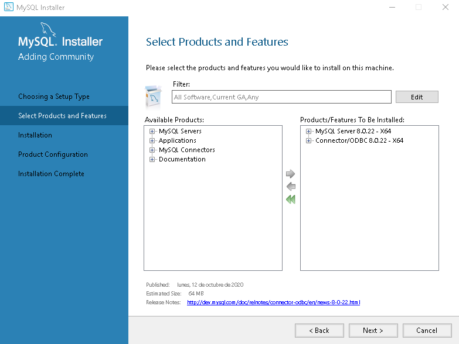
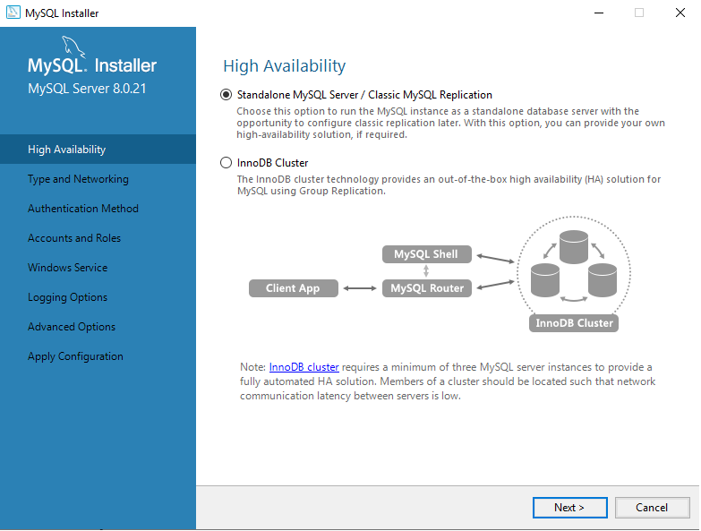

<!-- markdownlint-disable headings -->
<!-- markdownlint-disable no-inline-html -->

# IkData Windows 10 Installer <!-- omit in toc -->

## Tabla de Contenido<!-- omit in toc -->

- [Download requirements](#download-requirements)
  - [MySQL](#mysql)
    - [MySQL Installation](#mysql-installation)
- [Install](#install)
- [Update](#update)
- [Uninstall](#uninstall)

## Download requirements

### MySQL

Download `MySQL Installer 8.0.22` from [MySQL Community Downloads](https://dev.mysql.com/get/Downloads/MySQLInstaller/mysql-installer-web-community-8.0.22.0.msi)

#### MySQL Installation

1. Open `MySQL Installer 8.0.22` and select Custom option.

   - 

1. In the Available Products select:

   - `MySQL Server 8.0.21`
   - `MySQL ODBC`
   - 

1. Select Standalone option and continue with the installation.

   - 

## Install

1. Run [`SetUp.EXE`](https://github.com/Ortega-Dan/IkData-Installers/releases/download/v1.0/SetUp.EXE) **As Admin**.

    - Read and accept the Terms and Conditions, then click on `Yes`.

    

1. In the main window, click on `Install`.

    

1. Now you can choose the path where you want to install Ik-Data, or use the default path. Then, click on `Next`.

    

1. In this windows, you can `Start` the download of dependencies and IkData files (This process may take time depending on your internet connection).

    

    - When the download and installation finish, you can click on `Next`.

1. IkData uses a DataBase to many process, thats why you have to enter your MySQL root password to configure ikdata user. Click on `Next`

    

1. Finally, the installation process concludes. Click `Finish` to close the window.

    

## Update

- Run `SetUp.EXE` **As Admin**, if and update is available, the option `Update` will be visible.

    

- If you click on `Update`, and advertisement windows show you. You can accept (`Yes`) or cancel (`No`).

    

- If you accept the update, the download form appear, there you can `Start` the download or `Cancel` the update.

    

- When the update ends, the finish windows appear. Click `Finish` to close the window.

    

## Uninstall

- Run `SetUp.EXE` **As Admin**, if IkData is installed, the option `Uninstall` will be visible.

    

- When you select `Uninstall`, and advertisement windows show you, Click `Yes` to continue.

    

- When IkData is uninstalled, a second message let you choice between delete all IkData residual files.

    

- Finally, click Finish to close the window.
