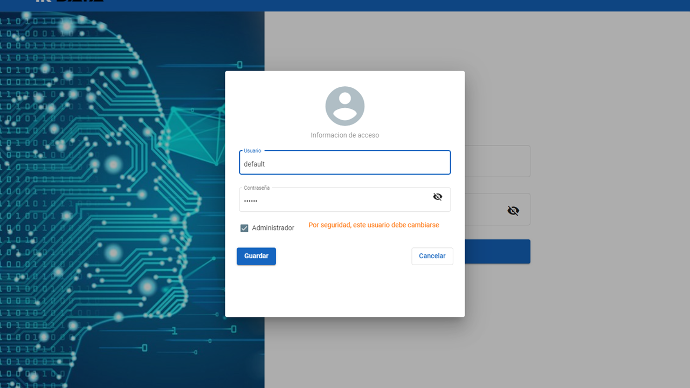
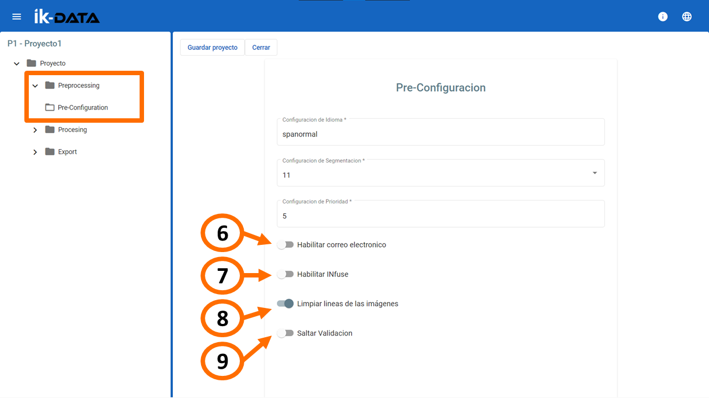
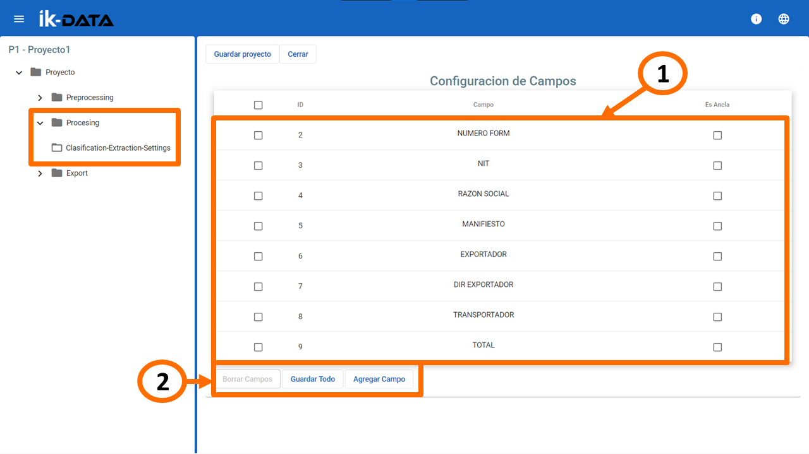
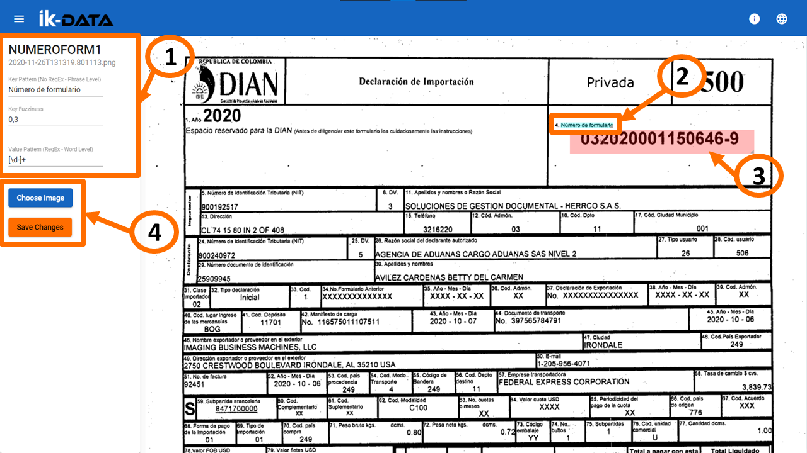
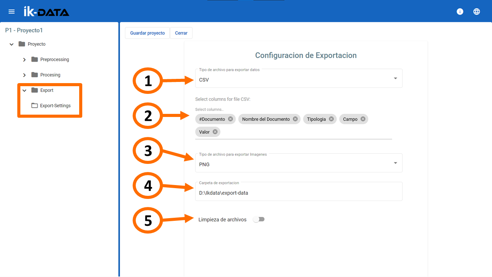
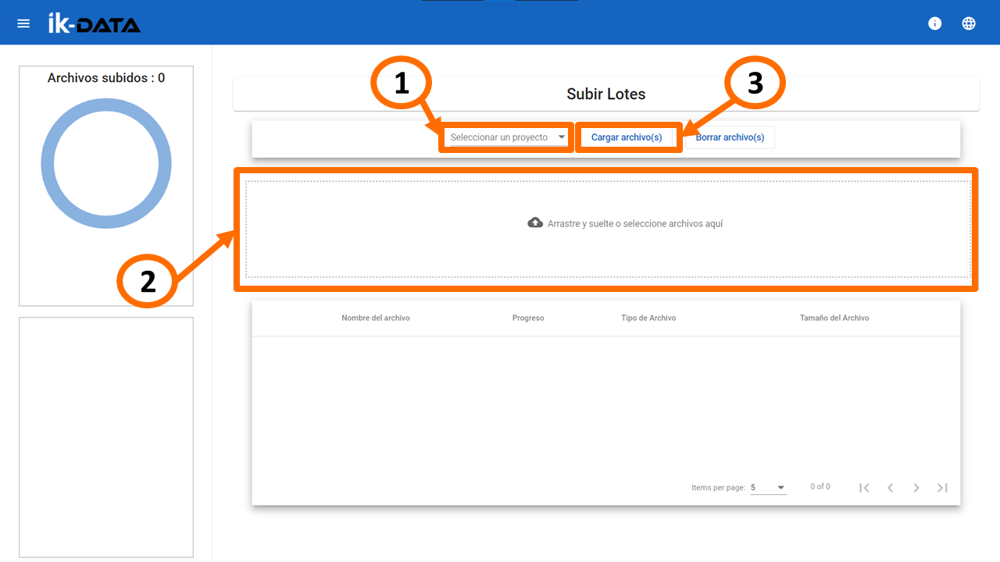
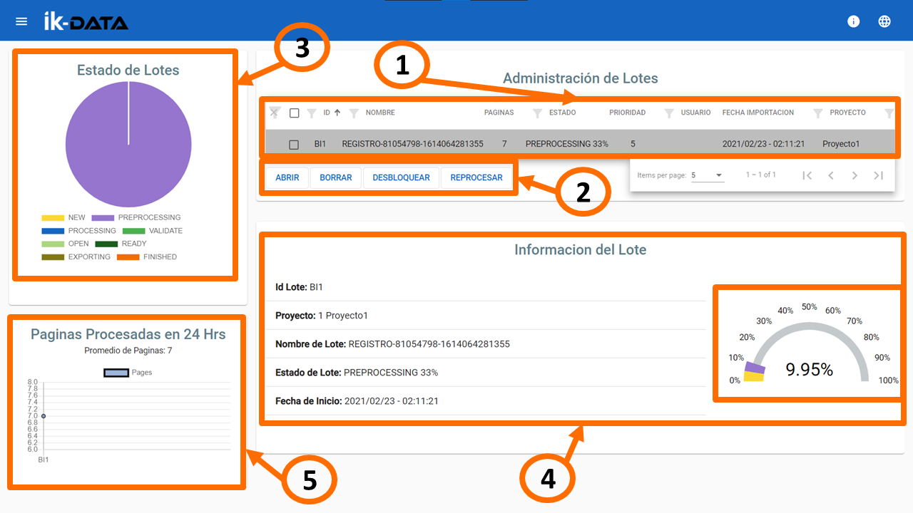
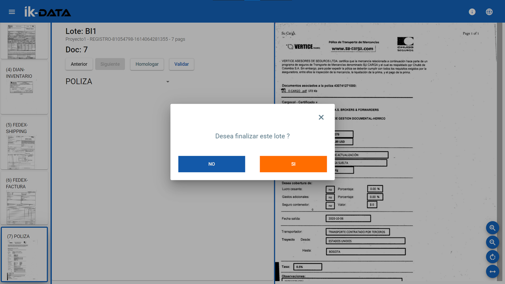

# Documentación Ik-Data <!-- omit in toc -->

## Tabla de Contenido <!-- omit in toc -->

- [Introducción](#introducción)
  - [Pantalla principal](#pantalla-principal)
- [Proyectos](#proyectos)
  - [Crear un proyecto](#crear-un-proyecto)
  - [Importar un proyecto](#importar-un-proyecto)
  - [Ver o Modificar proyectos](#ver-o-modificar-proyectos)
    - [Pre-procesamiento](#pre-procesamiento)
    - [Procesamiento](#procesamiento)
    - [Exportar](#exportar)
- [Subir imágenes](#subir-imágenes)
- [Administración de Lotes](#administración-de-lotes)
- [Usuarios](#usuarios)
  - [Crear usuario](#crear-usuario)

## Introducción

### Pantalla principal

Cuando ingresa a Ik-Data, se mostrará la venta de inicio de sesión donde encuentra:

  1. **Cambiar idioma**: Cambia el idioma de la interfaz (Inglés / Español).
     - NOTA: Este botón estará visible en todas las pestañas de la aplicación.
  1. Campos para ingreso de los datos de usuario.
  1. Versión de Ik-Data.

### Primer inicio de sesión <!-- omit in toc -->

Si es la primera vez que inicia sesión, deberá modificar los datos de acceso como se explica a continuación:

1. Ingrese el nuevo Nombre de Usuario.
1. Ingrese la nueva Contraseña.
1. Ingrese de nuevo la nueva Contraseña.
1. Haga clic en el botón `Guardar`

---

Una vez realizados los anteriores pasos, se mostrará una ventana indicando que la modificación ha sido efectuada.

Por defecto al iniciar sesión, ingresará a la pestaña de [Administración de Lotes](#administración-de-lotes). Para ver el menú, acerque el mouse al botón de la parte superior izquierda, indicado en el cuadro naranja de la siguiente imagen

El menú le permite navegar por las diferentes pestañas de la aplicación:

1. [Proyectos](#proyectos) : Lleva a la pestaña de `Gestión de Proyectos`
1. [Lotes](#lotes) : Lleva a la pestaña de `Administración de Lotes`
1. [Subir Imágenes](#subir-imágenes) : Lleva a la pestaña de `Subir Lotes`
1. [Usuarios](#usuarios) : Lleva a la pestaña de `Administración de Usuarios`
1. [Salir](#salir) : Cierra sesión.

[*Ir a a la Tabla de Contenido.*](#toc)

## Proyectos

La pestaña de `Gestión de Proyectos` está dividida en tres (3) secciones:

1. Listado de los proyectos disponibles en Ik-Data.
1. Control de vista de la lista de proyectos.
1. Botones de acciones sobre los proyectos:
   - [Nuevo](#crear-un-proyecto): Crea un nuevo proyecto.
   - [Importar](#importar-un-proyecto): Importar un proyecto a través de un archivo comprimido.
   - [Abrir](#ver-o-modificar-proyectos): Permite ver o modificar la configuración de un proyecto.
   - Exportar: Exporta el proyecto con todas las configuraciones actuales en un archivo ZIP.
   - Eliminar: Eliminar un proyecto.
      - NOTA: El proyecto no debe tener lotes pendientes.
    <!-- TODO: -->
   - Desbloquear: ...
   - Refrescar: Actualiza el estado de los proyectos.

### Crear un proyecto

Los pasos para crear un nuevo proyectos son:

1. Haga clic en el botón `Nuevo`.
1. Ingresar el nombre del nuevo proyecto.
1. Ingrese la ruta absoluta de una carpeta existente dentro del equipo.
1. Haga clic en el botón `Crear`.

### Importar un proyecto

Para importar un proyecto:

1. Haga clic en el botón `Importar`.
1. (Opcional) Ingrese el nombre del proyecto, si lo deja en blanco se usará el nombre que viene dentro del archivo comprimido.
1. Ingrese la ruta absoluta de una carpeta existente dentro del equipo.
1. Espacio para cargar el archivo comprimido (Arrastrando y soltando o haciendo Haga clic en cualquier parte de este espacio para abrir el cuadro de carga por default).

### Ver o Modificar proyectos

Cuando abre un proyecto, encuentra dos secciones:

1. Subsecciones de configuración
   - [Preprocessing (Pre-procesamiento)](#pre-procesamiento): Configuración generales del proyecto (idioma, prioridad, carpeta y medios de entrada).
   - [Processing (Procesamiento)](#procesamiento): Definición de tipos de documentos y campos de extracción.
   - [Export (Exportar)](#exportar): Configuración de formato y lugar donde se exportará la información obtenida.
1. Caja de botones:
   - Guardar proyecto: Guarda todas la modificaciones realizadas.
   - Cerrar: Regresa a la pestaña [Proyectos](#proyectos).

#### Pre-procesamiento

<!-- The Next oder list HAVE to have an explicit numeration -->

1. Ruta de la carpeta para subir archivos (lotes) para procesar.
2. ...<!-- TODO: -->
3. Idioma de los archivos.
4. ...<!-- TODO: -->
5. Puede elegir la prioridad que tendrán los lotes del proyecto respecto a otros proyectos (Siendo 1: Más importante y 5: Menos importante).

6. Puede configurar un correo GMAIL para procesar los archivos adjunto que a este lleguen.
7. Permite configurar un escáner [INfuse](https://www.alarisworld.com/es-co/landing-page/infuse-smart-connected-scanning).
8. ...<!-- TODO: -->

<!-- End of the explicit numeration-->

#### Procesamiento

En esta sección, encuentra los tipos de documentos que va a utilizar en el proyecto (Ej: Factura de venta, pagos, impuestos).

En la sección 2, encuentra los botones tres botones:

- Actualizar: Refresca los cambios el área 1.
- Borrar: Elimina los documentos seleccionados con el cuadro de selección (Check box).
- Nuevo Doc: Crear un nuevo tipo de documento.

---

Al hacer clic sobre un documento, se mostrará la configuración de dicho documento (tipología). La cual, está compuesta por:

1. Datos generales (De izquierda a derecha):
   - Nombre de la tipología.
   - Descripción.
   - Margen de confianza: ...<!-- TODO: -->
2. Area para cargar una imagen de referencia.
3. Elimina la imagen actual.
4. Descargar la imagen
5. Activar o desactivar la vista previa.
6. Área de vista previa.

Una vez creado y configurado un tipo de documento, puede añadir los campos que necesita buscar para extraer la información que requiera. Para ello:

1. Haga clic en el botón con los tres puntos verticales.
1. Extracción de campos.

---

En esta pestaña, puede establecer los campos de interés.

1. Lista de campos.
2. Acciones sobre los campos.
   - Agregar Campo: Añade un nuevo campo.
   - Guardar Todo: Guardar todos los cambios realizados.
   - Borrar Campos: Elimina los campos seleccionados.

En cada campo puede agrupar sub campos que contengan los datos a encontrar. Pulse sobre cualquier campo y vera una lista desplegable donde podrá:

- Modificar el nombre dek sub campo. Presionando en la franja azul.
- Activar o desactivar con el cuadro de selección de la parte derecha.
- Borrar uno o varios, seleccionándolos con el cuadro de selección de la parte izquierda y presionando el botón `Borrar Extracción`.
- Agregar un sub campo, haciendo clic en el botón `Agregar Extracción`.
- Ver o modificar las opciones del sub campo, haciendo doble clic en cualquier zona del área gris opaco, distinta a las mencionadas anteriormente.

Aquí se resaltan, las siguientes regiones:

1. Información del sub campo:
   - Key Pattern: Texto del título del campo a encontrar.
   - Key Fuzziness: ...<!-- TODO: -->
   - Value Pattern: Expresión Regular del dato a obtener.

1. Área donde se ubica el Key Pattern.
1. Área donde se ubica el Value Pattern.
1. Acciones:
   - Choose Image: Selecciona un documento de referencia.
   - Save Changes: Guarda todos los cambios.

#### Exportar

Una vez procesado y validado los cada documento, se exportarán los datos extraídos, aquí podrá hacer ajustes según lo requiera:

1. Seleccione el tipo de archivo (CSV o JSON).
2. En caso de haber seleccionado CSV, seleccione los campos.
3. También serán exportadas las imágenes resultantes, y puede elegir el formato (PNG o TIF).
4. Carpeta donde serán exportadas los archivos.
5. Seleccione si quiere que se haga Limpieza de archivos.

## Subir imágenes

[*Ir a a la Tabla de Contenido.*](#toc)

Para subir lotes (documentos PDF, imágenes JPG, png, TIFF) se puede hacer desde la carpeta asignada al proyecto o desde la pestaña 'Subir imágenes' como se explica a continuación:

1. Selecciones el proyecto al cual va a cargar el lote.
1. Cargue el archivo (Arrastrando y soltando o haciendo Haga clic en cualquier parte de este espacio para abrir el cuadro de carga por default).
1. Haga clic en el botón `Cargar archivo(s)`.

## Administración de Lotes

Una vez cargado el archivo o lote, comenzará a procesarse y aquí podrá ver el progreso:

En este punto podrá validar los datos procesados haciendo doble clic en el lote.

Aquí se presenta:

1. Cada página del lote.
2. Acciones:
   - Anterior o Siguiente, permite moverse por los campos.
3. Tipo de documento.
4. Campos y valor obtenido.
   - Si está en Naranja, significa que hay bajo porcentaje de confianza en la detección. Realice la corrección, de ser necesario, y pulse el botón Validar.
5. Indicación del lugar del campo identificado dentro de la imagen.
6. Controles de vista. Podrá aumentar el tamaño de la imagen si requiere comprobar el dato del campo.

Una vez finalizada la validación, se mostrará un aviso donde podrá confirmar que ha finalizado la validación o cancelar y seguir revisando.

Al haber confirmado la validación, se exportarán los datos del lote y habrá finalizado.

[*Ir a a la Tabla de Contenido.*](#toc)

## Usuarios

Desde esta pestaña puede editar, eliminar o crear un [nuevo usuario](#crear-usuario).

### Crear usuario

1. Haga clic en el botón Crear usuario.
1. Ingrese el nombre del usuario.
1. Ingrese la contraseña.
1. Ingrese nuevamente la contraseña.
1. Seleccione si el usuario va a tener permisos de Administrador.
1. Haga clic en el botón Guardar.

[*Ir a a la Tabla de Contenido.*](#toc)
